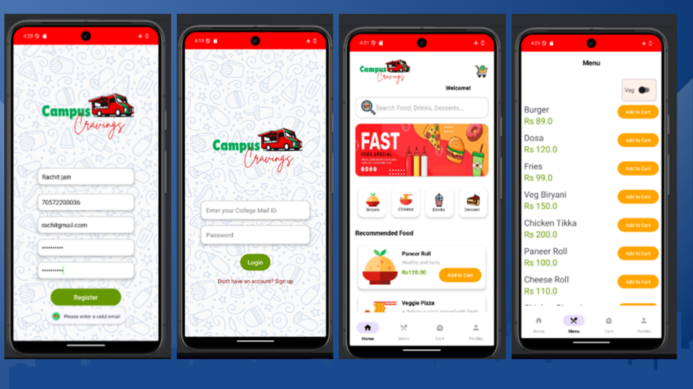

# 🍔 CampusCravings - On-the-Go 🚀  
**Seamless Campus Food Ordering at Your Fingertips**  

## 📌 About the Project  
Tired of waiting in long queues at campus food trucks? **CampusCravings** makes food ordering effortless!  
Browse menus, place orders, and track them in real time—right from your phone.  

## ✨ Features  
✔ **User-Friendly Interface** – Simple, intuitive design for smooth navigation.  
✔ **Live Menu Updates** – Stay updated with the latest food truck offerings.  
✔ **Order Tracking** – Know exactly when your food is ready.  
✔ **Personalized Experience** – Save your preferences for quick reordering.  
✔ **Offline Mode** – View past orders and menu items without internet.  
✔ **Secure Authentication** – Encrypted user logins for safety.  

## 🔧 Tech Stack  
- **Android (Java, XML)** – Native mobile app development  
- **SQLite Database** – Efficient local storage for user data  
- **BCrypt Encryption** – Secure password storage  
- **RecyclerView & Adapters** – Smooth UI experience  

## 🏗 Application Structure  
  

📂 **Authentication** – Secure login & registration with password hashing  
📂 **Navigation** – Bottom navigation with Home, Menu, Cart, Profile  
📂 **Database Management** – Local storage using SQLite for fast access  
📂 **Cart & Orders** – Manage items, track total cost, and confirm purchases  
 

## 🚀 How to Run the App  
1️⃣ Clone the repository  
2️⃣ Open in **Android Studio**  
3️⃣ Sync & build the project  
4️⃣ Run on an **Android Emulator** or **physical device**  

## 🔮 Future Enhancements  
🚀 **Admin Dashboard** – Manage food truck menus & orders  
🎨 **Better UI/UX** – Enhanced animations & transitions  
📲 **Profile Editing** – Users can update their details  

---

🌟 *Transforming Campus Dining—One Tap at a Time!*  
